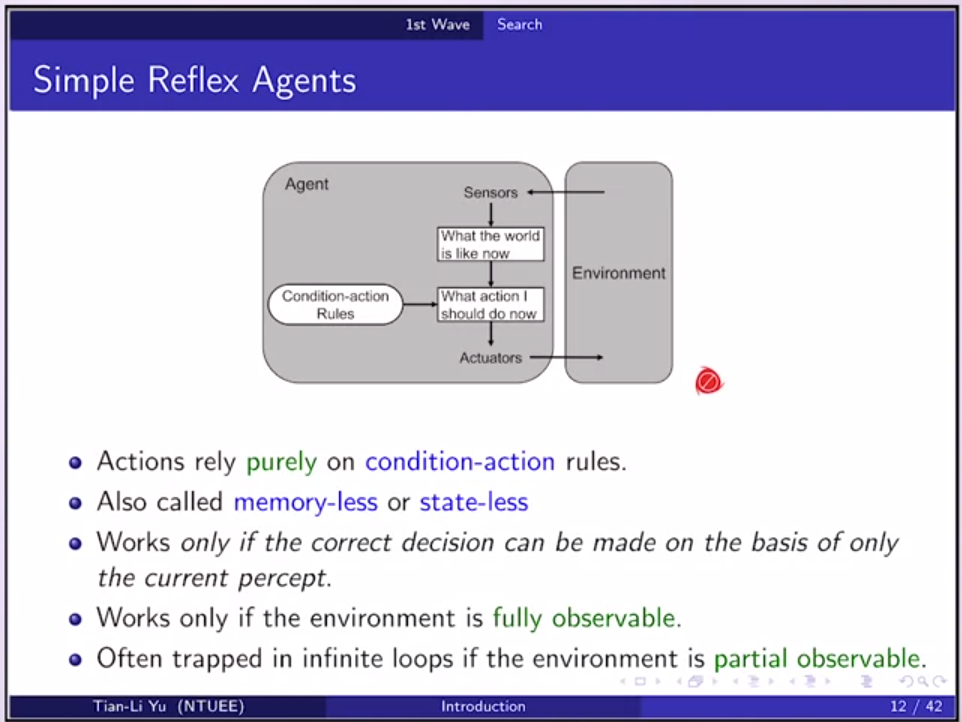
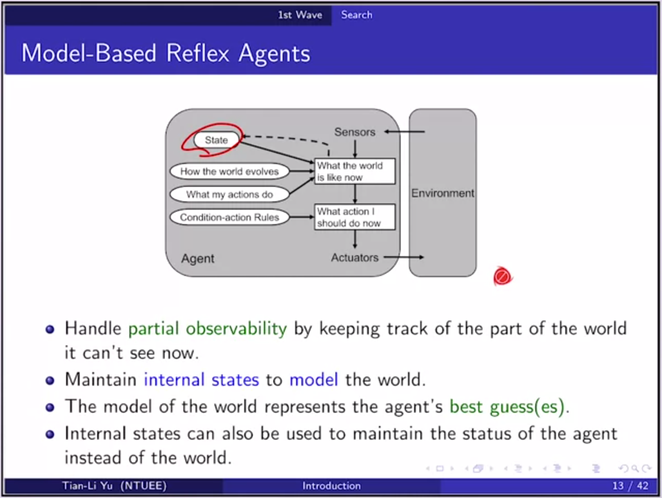

# 第一周笔记

[toc]

## 什么是AI

|      |         人类         |       合理性       |
| :--: | :------------------: | :----------------: |
| 思考 | 像人一样思考（强AI） |     合理地思考     |
| 行为 |     像人一样行动     | 合理地行动（弱AI） |

### 像人一样行动

- 图灵测试（1950年）：受试者在**知道自己是处于于测试当中**，对被测试对象提出一些书面问题，受试者**无法区分被测试对象是人还是机器**，则表明通过图灵测试。

### 合理地行动

- 在**有限的信息**下，**最大化**能够得到的预期结果。
- 不一定需要思考，可以依靠**条件反射**。
- 合理不一定意味着全能全知。
- 做出合理地行为要求：
  1. 在合理的时间里获取需要的信息（information gathering）：
     - Agent获取信息的时间越长，获取到的信息越多，但必须要在**合理的时间范围**内获取，不能取无限长的时间。
  2. 合理地尝试（exploration）：
     - Agent需要对一些**未知的事情做出尝试**。
  3. 学习（learning）：
     - Agent对作出尝试等行为后**得到的反馈要记录下来**，也就是**学习**。
  4. 自动化（autonomy 重要）：
     - 在一个环境中，随着**学习时间的增长，Agent受初始状态的影响越来越小，所做的行为也与初始状态无关**，也就是说Agent可以用学到的知识对以前的状态进行覆盖，这样可以保证哪怕所给的初始条件有错误，Agent也可以通过学习来进行修正。

## Agents 与 环境

- Agent根据从环境中获取到的感知序列来选择对应的行为，而Agent所做出的行为又会在一定程度上改变环境。

- **三个重要的失真**：

  1. 感知（sensors）：Agent从环境中获得的感知序列可能会失真。

  2. 行动（actuators）：Agent所做的行动会有误差。

  3. **Agent函数（Agent function）**：我们无法做到将任意一个感知序列通过一个函数完美的映射到一个指定动作上去，有两点原因：

     1.  记忆体不足：Agent**无法记录完整的感知序列**，因为随着时间的推移，感知序列越来越长，逐渐趋于无穷大，这就导致Agent的**记忆体**无法保存这无限长的感知序列数据。
     2. 运算时间不够：即使Agent的**记忆体**可以保存这无限长的感知序列，但由于感知序列无限长，导致对感知序列**处理的时间也是无限长**。

     现实中我们只能实现一个对Agent函数失真的实现，即**Agent程序**。

### 工作环境（PEAS描述）

 

- 确定环境（PEAS）：
  - 性能指标（Performance）
  - 环境（Environment）
  - 执行器（Actuators）
  - 传感器（Sensors）

- 环境类型：

## 不同级别的AI

- Level0：属于最低级AI，属于市场营销的产物，不能称之为拥有智慧
- Level1：可以基于所**给定的知识体系**，在里面进行**搜索，规划**出解决方案
- Level2：在Level1的基础上，能够进行**自我学习，探索**，会随着时间的推移，越来越聪明。
- Level3：**自动寻找特征**，自动去寻找所给知识中隐藏的pattern是什么，可以进行**高阶的抽象化**。

- AI：重点需要**表现出智慧**，但**不一定需要通过学习**，可以通过**规则**来表现出智慧。
- ML：**一定要进行学习**，独立于AI，但有重叠部分，**不一定要有智慧**。
- DL：**属于ML**中的一种方法。

## 人工智能的发展历史

人工智能发展分为三个阶段：

### 阶段一：Debut（1950~1970）

#### 简介：

- 人们觉得电脑可以取代人工
- 主要研究：Search，Neural Networks。

#### Search 技术：

1. Simple Reflex Agent（最简单的Agent）
   
- 此类agent只基于**当前感知器的感知信息**来选择行为，**不关注感知历史信息**。
   - 完全依赖于**“条件-行为”规则**。
   - 如果环境信息是**完全可见**的，将会工作的很好。
   - 如果环境信息是**部分可见**的，将会**不断在某一状态中循环**。
   
2. Model-Based Reflex Agent
   

   - 此类Agent会根据感知历史，**维护一个内部状态**，并基于此建立模型。
   - 模型包含对当前世界的一种**最佳猜测**，但**不一定准确**。
   - **模型越复杂**，则对当前世界猜测的**越准确**，但过度复杂，会导致**过拟合**。
   - 建立的模型与现在感知到的信息结合起来，对当前状态进行更新。

3. Goal-Based Agent
   

   - Agent使用**goal**来代替“条件-行为”规则，根据goal来决定做出什么行为。
   - 对于需要通过复杂的行动序列才能满足goal时，使用**“搜索”与“规划”**
     等方法来达成Agent的goal
   - 与反射性Agent不同的是，该Agent**考虑了未来的信息**

4. Utility-Based Agent
   

   - 对于一个目标，会有**不同的行动序列**，这些不同的序列能够对Agent产生不同的“快乐”程度。
   - 对于“快乐”程度需要有一个**量化指标**。
   - 以上的“快乐”程度即为“效用”（Utility）。
   - 需要**最大化效用的期望值**。

##### Search技术的成就

- IBM的深蓝击败了棋王

##### Search技术的问题

- 解决的问题大都是 "Toy Problem" ，即该问题**从现实世界抽象化为数学模型**后，基本**没有出现失真问题**，但不意味是简单问题，可以很难，例如下围棋。
- 对于抽象化过程中**失真较多的问题无法解决**，或者解决出来了，但却由于抽象化的过程中**失去了太多细节部分，导致所给的解决方案无效**。

#### Neural NetWork(简单介绍了一下)

- 从人脑的神经元受到启发，开发人工神经网络

- 第一阶段的神经网络，即感知机时期。
- 认为神经元可以实现任何任务，只要神经元数量够多。
- 两个问题：
- 
1. XOR问题

   - 人工神经网络对于Xor无法用单一神经元来表示，需要多个，而And与Or只需要一个。
   - 人脑对于Xor运算很容易，但对于And与Or的识别，则需要一段时间的训练。

2. 神经网络有极限，或者说是局限性，不一定能做到人能做到的事情。

### 阶段二：Knowledge Driven（1980~1995）

- 主要研究知识体系，认为知识越多，可以解决越多的问题
- 主要研究：专家系统，知识系统
- 问题：在知识库十分庞大的情况下，需要花费越来越多的时间来得出正确的结论或行为。

#### 专家系统、知识库的建立：

##### 技术困难

- "part of" 问题，会产生**本体论**问题，例如对一个蛋糕一直切，切到最后，剩下一个水果，蛋糕上的水果在离开蛋糕后，并不是蛋糕的一部分，但在蛋糕上却是蛋糕的一部分，即**无法确定一个物体在去掉多少原有的物质后会变为另一个物体**。
- "Common sense" 问题，即**常识问题**，对于人很容易辨别的常识，电脑很难学会。
- "Frame problem" ，即在**知识库十分庞大的情况下，不应考虑每一条Rule，考虑该rule是否与当前要做的事情是否有关**，如果考虑的话，会导致考虑的时间过长，而无法在有限的时间内作出合理的动作。而**电脑很难判断哪些rule与当前做的事情有关，会花费大量时间在判断rule的相关性上**。
- "Symbol problem"，即对电脑来说，**所有事物都是一个symbol**，一切都是平等的，对于不同的事物，**很难与现实中的意义进行连接**。例如，对电脑来说，`猪会不会飞`与`笔还有没有墨水`是等价的。

### 阶段三：Data Driven（2010~now）

- 资料越来越重要 ，主要是由于从2000年开始网络的兴起
- 主要研究：机器学习，特征的自动提取生成。
- 不应有过高的期望，此阶段距离人脑还有一段距离。

#### Learning & Data

- 资料十分重要，资料不足，再好的算法也学不到任何东西。

- 机器学习主要由**监督与非监督学习**
- 用于分类任务

- 相比于Training error与True error，人们对**OTS**更加感兴趣。

- 没有免费午饭定理，**脱离了具体问题，谈论算法的好坏是没有意义的。**

- 奥卡姆剃刀原理，**简单的假设就是最好的假设。**

- 太简单（欠拟合）与太复杂（过拟合）的模型在遇到新的测试数据时，表现都不好

- 交叉验证法，将testing分为K份，每次取出K-1份来训练，1份做测试，轮K次，取测试的平均值。

- 传统模型大都是浅层模型，例如SVM、贝叶斯等。
- 浅层模型对简单概念表现很好，而深度模型可以做更高层次的抽象化，对于比较模糊的概念，表现的更好。

- 卷积神经网络，使用稀疏网络，共享权值等方式来训练网络

## 总结

### AI/ML能做的事情

- 可以学习一些隐藏的pattern，但前提是**存在这些隐藏的pattern**。
- 需要**足够大的训练数据量**。
- 必须要有一个**前提假设**。
- 目前DL技术可以自动找出feature
- 当前阶段的技术**缺乏理论支撑**，更多的是实战经验。

### AI/ML暂时无法做到的事情

- **无法做到无中生有**，也就是缺失的资料是无法找回的，例如一张模糊的照片，使用AI/ML技术进行修复，无法将已经完全丢失的信息复原，只能将还存在的信息进行提取合成。
- 在没有 prior knowledge 的前提下是无法做到学习的，即**必须要有一定量的 prior knowledge** 才能学习。
- 用于学习的资料的 **noise不能太高**，过高的 noise 会导致无法学习到有用的知识。