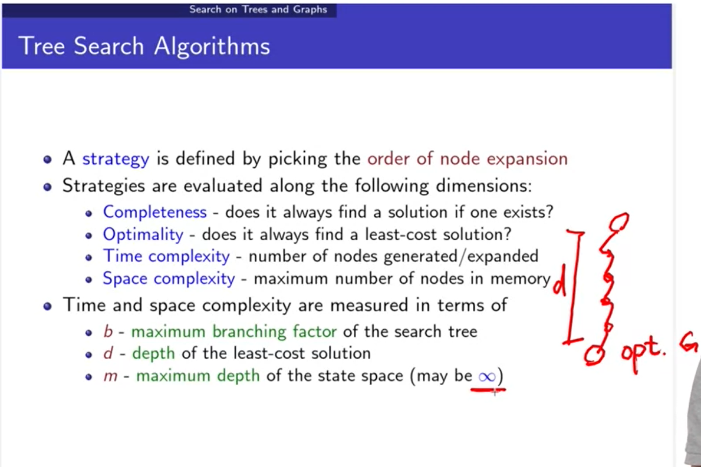
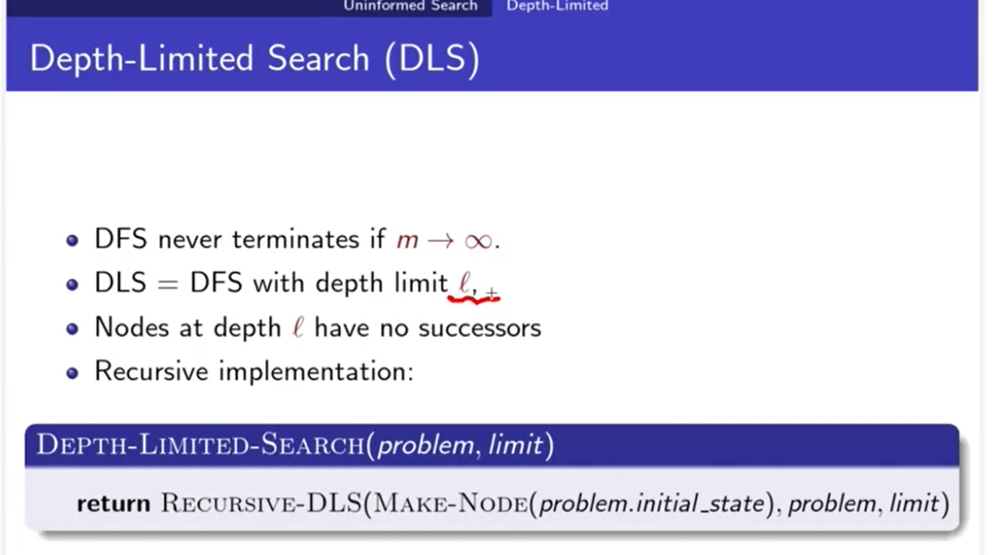
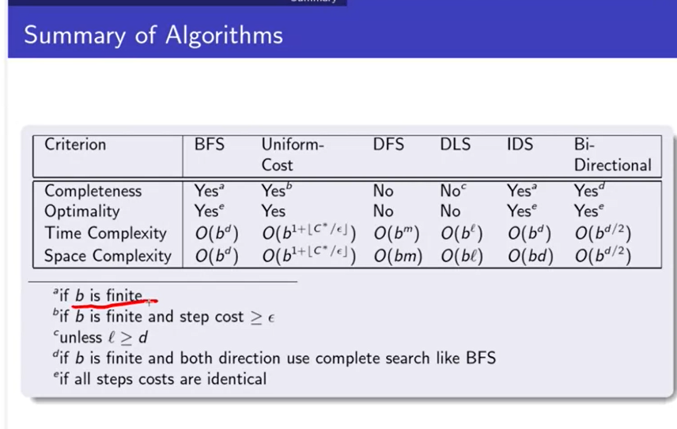

# 第二周

[TOC]

## 无信息搜索(Uninformed Search)

### Problem-Solving Agent

一个以Search为中心的Problem-Solving Agent：

- 在初始状态下，首先它会根据对**当前世界的猜想（State）**来规划一个Goal。
- 接着，根据**当前的State与Goal**去将Problem公式化。
- 然后将这个进过Formulate的**Problem作为输入**给Search进行执行。
- Search执行后返回一个执行序列Seq
- 对执行序列中的**每一个动作依次执行，并返回执行结果，直到执行序列为空**。
- 当seq为空后，在根据当前State进行Goal的规划，也就是返回到了步骤一，**不断循环执行整个过程**。

#### Example

- 规划的目标：到达台北车站
- 构造的问题：
  - States：所在地铁的不同站点
  - Actions：在两个站点间进行转移
- Search方案：一个移动序列

- 当前所处站点：古亭
- 目标：台北车站

### Problem定义

- Problem的定义组成：
  1. 初始状态
  2. 在某一个State下的可选Action集合
  3. 在某一State下，执行一个Action后的结果，或者是某一个State下所有可能的转移结果集合
  4. 对Goal进行测试，Goal可能是一个Set，所有在Set里的都是可取的Goal
  5. 从Initial State 到一个Goal的Cost。
- Solution是一个从起始状态到一个Goal的行动序列。

### 抽象化

- 现实生活中的Problem转化到Computer中的Problem后，由于高度的抽象化，会导致**丢失许多Details**，所以最后计算机给出的**Solution可能是无法使用**的，因此我们需要对所给方案做出一个**保证**，需要保证这些方案是**可实现的**。

- 要保证方案可实现，就需要使得**当前Real State集合中的所有子State**（any state）对应到**下一个Real State集合中的部分子State**（some state）。

- Formulate一个好Problem会大大减少State的space。

### 搜索类算法分类

#### Tree Search Algorithms

- 使用Problem的初始状态来初始化Frontier
- 不断重复以下步骤：
  - 如果当前链表为空，则返回失败
  - 否则，从Frontier中读取一个Node
  - 对该Node做Goal Test
    - 如果成功，则返回相应的solution
    - 否则继续扩展该Node的子节点，并将扩展的Node加入到Frontier中。

- Tree Search的缺点：
  - 如果在Search的过程中，遇到的State与之前处理过的State一致，Tree Search仍然会对其进行**再次扩展**，也就是**不保存之前已处理过的State**，对所有遇到的State都视为**全新的State**，会造成相同State的**重复扩展**。
  - 解决方法：对每一个State**取其hash值**，**保存到一个状态队列中**，下次在扩展State前，**先检查该State的Hash是否已经存在，如果存在则不再扩展**。
- *PS：PPT上写错了，Graph应该改为Tree。*

#### Graph Search Algorithms

- 使用Problem的初始状态来初始化Frontier

- 将Export Set进行初始化为空

- 不断重复以下步骤：

  - 如果当前链表为空，则返回失败
  - 否则，从Frontier中读取一个Node
  - 对该Node做Goal Test
    - 如果成功，则返回相应的solution
  - 将该Node加入到Export Set中
  - 扩展该Node的子节点
  - 如果扩展后的Node不存在于Export Set中或Frontier中
    - 则将扩展的Node加入到Frontier

#### Tree Search 与 Graph Search的区别
-  Tree Search与Graph Search基本上大体思路是一样的，主要的不同之处在于**Tree Search不保存已经扩展过的Node**，也就是**没有记忆体**，而**Graph Search是有记忆体**。

#### State与Node在实现上的区别

- State与Node大体上是一致的，二者可以说是一对一，但不是百分百一样。
- **State只包含状态信息**，一般单独使用，或者**多个State视为一个State Set**，不同State之间**一般不进行连接**。
- Node用于表示**一个Search Tree上的节点**，除了包含**State，还包含父节点、孩子节点、当前搜索深度，到达该Node的Cost等信息**，不同**Node之间有连接**。

#### Search Algorithm 的基础

- Node的更新方式：
  - Node的State是由Parent的State经由指定Action到达
  - Cost如果是可叠加的，则就是Parent的cost加上对Parent State进行指定Action后的Cost。
- Frontier在实现上就是一个Queue，可以是以下几种类型的Queue：
  - FIFO（先进先出）
  - LIFO（后进先出），也可认为就是Stack
  - Priority Queue，也就是Heap。

#### 不同Search Algorithms 的性能评估

- 不同的Search Algorithm之间的主要区别体现在对**Node展开顺序的差异上**。

- 对于不同的Algorithm进行性能评估，主要由以下四个维度来体现：

  1. Completeness（完备性）：即如果该Problem有Solution，那么该**Algorithm能否保证可以找到该Solution**。
  2. Optimality（最优性）：即找到的**Sloution是否为最优**的，同时如果有Cost，那么**所花费的Cost是否为最少**的。
  3. Time Complexity（时间复杂度）：找到Solution**所需花费的时间**。
  4. Space Complexity（空间复杂度）：执行Search过程中，**所需要的的内存空间**。

  - 上述不同维度中，**如果不满足Completeness，那么必然无法满足Optimality**，因为**无法找到解，也就没有所谓的最优解**。
  - Graph Search相比于Tree Search来说，**性能上会更好**，但需要有个**前提**，就是**有足够的记忆空间**，也就是Space，所以在现实实现AI中，**空间复杂度相较于时间复杂度更为重要**。

- 对于复杂度（空间复杂度与时间复杂度）来说，主要由以下三方面来决定：

  1. 分支因子（B）：该搜索空间中**最大的后继节点个数**
  2. 最小深度（D）：**Cost最少**的Sloution所需要的**经过的节点数**
  3. 最大深度（M）：该搜索空间中，**最长的搜索路径**，或者说经过的**最多节点的Path**，也就是花费的Cost最多。对于不同的Problem，该**值可以是$\infty$。**

### Uninformed Search算法

- Uninformed Search又称为盲目搜索（Blind Search），因为它**能使用到的有消息都仅限于问题的定义中**（问题的定义见上文，一共有5部分），不包含除此之外的其它任何知识。
- 算法主要有五种：
  1. BFS（宽搜）
  2. Uniform-cost Search（一致代价搜索）
  3. DFS（深搜）
  4. Depth-linited-search（深度受限搜索）
  5. Iterative deepeding search（迭代加深搜索）

#### BFS

- BFS比较简单，使用一个FIFO Queue来保存每次扩展完成的Node。
- 除第一次扩展外，每次都是**从Queue中拿出队首元素进行扩展**，扩展完成后**将扩展后的Node加入到队尾**，不断循环重复，**直至Queue中没有元素为止**。

##### 特性

- **具有完备性**，但要求**分支为有限个**。
- 基本**不具备最优性**，或者说满足最优性的条件极为苛刻，因为BFS所给的sloution永远都是在最浅的一层，那么**只有在该Problem的solution同时具备了深度最浅与cost也是最少的情况下才可满足最优性**。
- 时间复杂度与空间复杂度都为$O(b^d)$（对于b与d的定义见上文`性能评估`）
- **问题：对于BFS来说，由于其每一步都需要保存state的缘故，导致空间复杂度太高，如果状态数比较多的情况下，则会由于内存不足的原因而无法实现，所以就如上文所说，相比于时间复杂度，空间复杂度更为重要。**

#### Uniform-Cost Search

- Uniform-Cost Search**每次都是展开cost最少的节点**。

- 使用**Priority queue来维护已展开的Node**。

- 当Problem中**每一步的Cost都是一样的时候，此时等价于BFS，**也就是说BFS是其一个特例。

- 在遇到**相同节点**的时候，Tree Search与Graph Search的处理方式不一样

  - Tree Search会得到**相同节点的两个不同的分支，返回cost较小的分支**。

  

  如上图所示，就是Tree Search的结果，会得到相同Node，但出于两个不同分支的结果，返回cost少的那个分支。

  - **Graph Search**会对该Node进行**松弛操作（Relaxation）**，**比较已经存在于queue中的该Node的cost，与当前到达该Node的cost，哪个小，将小的cost给该Node。**

##### 特性

- 具备完备性（**只需要每一步的cost都大于0**）
- 具备最优性
- 时间复杂度与空间复杂度都为$O(b^{1+{\lfloor}C^*/\varepsilon{\rfloor}})$
- **问题与BFS基本一样，由于此类算法的自身特性问题，空间复杂度很难降下来**

#### DFS

- DFS比较简单，**一般使用递归或stack来实现**。
- **永远展开深度最深的Node**。
- 每展开一个Node，就将该Node的子节点加入到stack中

##### 特性

- 不具备完备性，因为会出现**无限深的解空间**。
- 不具备最优性
- 时间复杂度为$O(b^m)$，注意`m`代表的是解空间的最大深度，比BFS的`d`要大。
- **空间复杂度基本为线性空间，$O(bm)$。**
- 问题：虽然DFS在**空间上的特性很好**，但**其它方面都十分糟糕。**

#### Depth-Limited Search（DLS）

- DLS改进了**DFS在深度为无穷时不会返回**的问题，**对Problem的最大搜索深度做了限制**，如果在当前**分支的深度达到限制L时，还都没有找到解**，则**原路返回**，**去寻找另一个分支**。

##### 特性

- 具备的特性基本与DFS差不多。
- 具备了**部分的完备性**，前提是**$d < l$**，也就是**goal所在的深度要小于限制的深度**。

#### Iterative-Deepening Search（IDS)

- 迭代加深搜索算法是在DLS的基础上，**对限制L不断地放宽**，从而实现BFS与DFS特性的融合。
- 将L从$0$不断放宽至$\infty$，在每次放宽后进行DFS。

- 例子：
- 

##### 特性

- 具备完备性。
- 具备部分的最优性，如果使用**深度作为限制**，那么要求**step cost为1**，如果使用**path cost作为限制**，那么就**完全具备了完备性**，但此时的**时间复杂度很槽糕**。
- 时间复杂度为$O(b^d)$
- 空间复杂度为线性$O(bd)$
- IDS对于重复计算的问题其实并不严重，基本与BFS保持在**同一个数量级**上，所以对此无需关心。事实上，当**深度越深**，**解空间越大**的情况下，**IDS表现的就越好**。

#### Bidirectional Search

- 双向搜索就是**同时从初始状态与目标状态开始展开**，**同时进行搜索**，直到**两边有接触**。
- 显著的降低了时间复杂度，从$O(b^d)$降至$O(\sqrt{b^{d}})$。
- 缺点：
  - **需要知道Problem的Goal**，但有时候无法提前知道Goal是什么
  - **需要action是可回退的**，也就是说不仅要可以$S\to G$，也要求$G \to S$，也就是说$S \leftrightarrow G$，但大部分action都无法满足，譬如：水从水瓶中撒出去的action，无法找到一个与之对应的水回到水瓶中的action。
  - 空间复杂度虽然降低了，但仍然较高。

### 总结

#### 各算法对比

- IDS性能综合来说比较好

#### 章节总结

- Problem定义就是一个**对现实世界实体的抽象化过程**。

- Problem需要定义以下5方面：

  1. 初始的State
  2. 执行的Action
  3. 转移模型
  4. Goal测试
  5. 路径Cost

- 原则上**Graph Search**比**Tree Search**更有效率。

  - 因为Graph Search对于已展开的Node不会再次展开，但有一个前提就是**有足够的内存来记忆已经展开过得Node**。
  - 一般来说使用Tree Search，为了提高效率会使用**加了限制条件的记忆体**，譬如只记忆最近看过的100W个State，如果在**展开的过程中遇到了在这100W个state中的Node，则不再展开**，如果**保存的State超过了限制，则将最早放入的State丢弃**

- 对于不同的Search算法主要从以下4个点来讨论

  1. 完备性
  2. 最优性
  3. 空间复杂度
  4. 时间复杂度

  - 一般而言，以Uniform-Cost Search为代表的算法在1、2这两方面都不错，但在第3点上比较糟糕，以DFS为代表的算法在第3点上表现比较好，但在其它方面都不行，而**综合了两者优点的IDS是一个比较好的选择。**