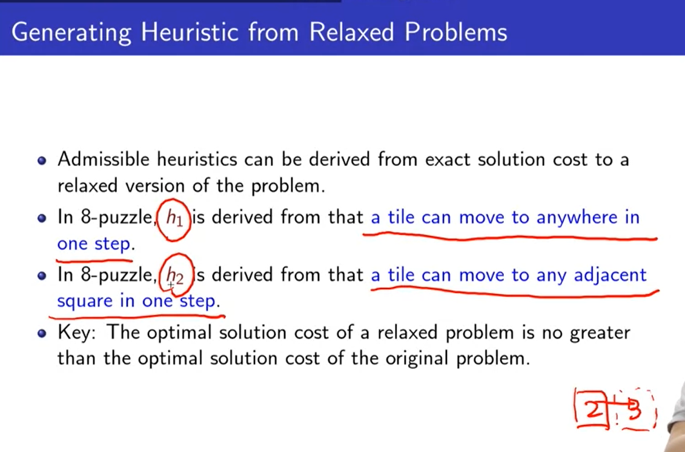

# 第三周

[TOC]

## Informed Search（有信息搜索）

- 大纲

### Best-First-Search

- Informed Search也就是启发式搜索，它包含对**未来**的一个预估
- 使用一个启发函数来对接下来的每一个Node进行评估，然后将评估结果最好的那个Node进行展开
- 启发式会评估从指定Node到**最近的Goal**所需花费的Cost
- 两个特例：
  - Greedy Search直接使用启发式的评估结果，即估计指定Node到达最近Goal所需要的的花费h(n)作为F值
  - A*使用从Start到达指定Node所需要的花费g(n)+估计该指定Node到达最近Goal所需要的的花费h(n)作为F值

#### Greedy Search

##### 特性

- Greedy Search**只是用启发函数的预估值来作为节点的展开条件**，即优先展开那些最接近Goal的Node，忽略对该节点的展开所需要开销(cost)。
- **不具有完备性**
  - 如果使用Tree Search，则会进入循环无法出来。
  - 如果使用Graph Search，可以基本保证完备性，但是在状态为无穷的时候，无法保证，且会导致*需要大量的记忆空间。*
- 不具备最优性，因为无法保证完备性
- 时间复杂度：*$O(b^m)$*，**但是如果启发函数所给的预估值十分好，那么时间复杂度会很低**
- 空间复杂度：$O(b^m)$，**会保存所有Node到内存中**。

#### A* Search

- A*总体思想是**避免对总体Cost大的Node进行展开**
- 启发函数：$f(n) = g(n) + h(n)$
  - $g(n)$：**从起始节点Start到达指定Node所花费的Cost**
  - $h(n)$：**评估从指定Node到达目标所需要的花费的Cost**
  - $f(n)$：上述两个值相加的结果，即**评估从起始节点Start出发，经过指定Node所需要花费的真实Cost，加上从该节点到达指定Goal的预估值的总Cost值**
- A*结合了Greedy Search与Uniform-Cost Search的优点

##### 特性

- 具备完备性：除非在无限个Node中，所有的的$StepCost\leq0$。
- 最优性（较为复杂，此处简单介绍，下文有详细介绍）：
  - A\* 的最优性**依赖于它的评估函数$h(n)$**是否是`Admissible`（ *可采纳性*）和`Consistent`（*一致性*），但并**不是必要条件**，即可能不具备`Admissible`与`Comsistent`，A\*也具有最优性。
  - 对于Tree Search，需要保证`Admissible`，也就是只要$h(n)\leq h^*(n)$即可
  - 如果是Graph Search，在保证了`Admissible`的基础上，还需要保证`Consistent`（下一节介绍）
- 时间复杂度：$O(b^{\epsilon d})$
  - 与$h(n)$有关，假设有一个完美的评估函数$h^*(n)$，$h^*(n)$的预估值与真实值完全一样，那么$h(n)$越是接近这个$h^*(n)$，则时间复杂度越低。
  - 可以使用$\epsilon$来表示二者的接近程度，$\epsilon=0$表示完全一样，$\epsilon=1$表示完全不一样，当$\epsilon=0$时，时间复杂度为最小$O(b)$，当$\epsilon=1$时，时间复杂度为最大$O(b^{d})$
- 空间复杂度：$O(b^{d})$

#### Optimality of A*

##### Admissible（可采纳性）

- 对于Tree Search，需要保证`Admissible`，也就是**只要$h(n)\leq h^*(n)$，即永远不对实际值高估即可。**
- 如果是Graph Search，**还需要保证`Consistent`。**

###### Admissible的证明

##### Consistent（一致性）

- 对于Graph Search除了需要`Admissible`，还需要`Consistent`
- 需要一个引理，如果$h(n)$是`Consistent`，那么在A*中任何path的f值都是**非增的**。
- 如果$h (n)$具有了`Consistent`，就是说，在Search过程中，f值会从某个最小值开始慢慢增大，A*每次会在一个固定的f值范围内去展开f值最小的Node，当该范围内的Node全部展开后，再调整被固定的f值，以此循环，如果在范围内找到了一个Goal，那么可知，该Goal一定是最优的。

##### 引理证明

#### IDA*

- IDA\*就是使用IDS的思想，**使用A\*的f值来作为搜索的限制**
- 每一次选取**未展开Node中最小f值的作为限制**

##### 特性

- 完备性与最优性与A*完全一样
- 时间复杂度：$O(b^{\epsilon d})$
- 空间复杂度：$O(bd)$，也就是线性复杂度
- 缺点：
  - 由于**使用未展开Node中的最小f值来作为每次迭代加深的限制**，这就导致了**大量的重复计算**，因为可能**对于每一个Node的f值都不一样**，那么，**每一次迭代都只会展开一个Node，这样时间复杂度的前置常数会极大。**

### Memory Bounded Search

#### RBFS

- RBFS使用递归的方式，用以避免A\*遗忘速度过快的问题，即不再每一次都从头开始计算。

##### 简介

- RBFS还是使用DFS的思想，保证了线性的空间复杂度。
- RBFS与A\*一样，每次都是展开f值最小的节点，但**同时会记录另一条路的f值来作为次优路径**；如果**当前所走的路径的f值大于次优路的f值**，则会**进行回溯，重新选择次优路径进行扩展**，同时在回溯的时候（也就是会遗忘该条路径），会**将该子树上最佳叶节点的f值，记录到路径上的每一个节点上（只记忆最终的结果，遗忘过程），以便未来决定是否需要重新展开。**

- f_limit就是限制的f值，初始传入的是$\infty$，之后每一次递归调用的时候，传入的都是$min(second\_lowest,f\_limit)$，其中`second_lowest`就是次优路径的f值，用于保证**如果当前的f值大于父节点中次优路径的f值，则此时需要进行回溯处理，回溯的同时，需要将当前最优的f值回传，父节点在接受到子节点回传的f值的时候，需要将原本的f值替换为回传的f值。**
- 例子：

- 由例子可以看出，因为RBFS记忆了次优路径的f值，所以在未达到次优f值之前，都可以不用再次重新从头展开，大大避免了像IDA\*的多次重复计算。

##### 特性

- 完备性与最优性与A\*一样
- 时间复杂度上比较复杂，取决于**启发函数的精确度以及展开节点时，改变最佳路径的频度**（最坏情况下，如果每一次展开都要更改路径，则复杂度会极其糟糕）
- 空间复杂度为线性

#### A\*与RBFS缺点

- 两者使用的空间都过于少，进而使得这两个算法都需要频繁的重新进行计算。
- 无论给多少内存，都不会显著提高二者的性能。
- *想法：希望能够充分利用内存空间*

#### SMA\*

- A\*与RBFS的结合，**运行A\*直到内存耗尽，然后将最糟糕的节点遗忘掉，遗忘的方式与RBFS类型，即需要记住该被遗忘节点的f值到父节点上。**

##### 问题

- 当要遗忘一个f值的节点时，可能会出现有多个节点与之对应，此时需要遗忘掉最老的，也就是最早被展开的node。

### Heuristic（启发函数）

- 八数码问题的两个启发函数。

##### Heuristic的性能度量

- 在多个$h (n)$满足`admissible`的前提下，如果对于每一个n，都有$h_1(n)\ge h_2(n)$，则称$h_1(n)$`dominates`$h_2(n)$，即$h _1(n)$要严格好于$h _2(n)$。

##### 定理

- 证明：
  - 前提：每一个f值比C\*（到达目标节点的Cost值）大的Node都会被展开
  - 因为$f (n) = h(n) + g(n) < C^*$，通过移项可知$h(n)  < C^* - g(n)$
  - 即每一个$h(n)  < C^* - g(n)$的Node都会被展开
  - 则可知$h(n)$越大，需要展开的节点越少。
- 结论：在保证`admissible`的前提下，$h(n)$越大，效果越好
- 推论：在有多个$h(n)$的时候，可以构造一个新的启发函数：$h_{best}=max(h_1,h_2,\cdots,h_n)$，从上面的定理可知，$h_{best}$优于所有的$h(n)$

##### Effective Branching Factor（有效分支因子b*）

- 对于一个给定的深度d，计算得所有展开的节点数N，然后将N代入下列公式，求出b\*，b\*的值越接近1，则表明该`heuristic`越好。
- 公式：$N+1=1+b^{*}+\left(b^{*}\right)^{2}+\cdots+\left(b^{*}\right)^{d}$

##### 启发函数的构造

###### Relaxation Problem（松弛问题）

- 一个`admissible`的启发式可以从一个松弛问题中得出，即**剔除掉一些原有问题中的限制条件，产生一个更简单的问题。**
- **PS：新问题解的cost不可以高于原有问题的cost**

###### Sub-Problem（子问题）

- 可以从考虑原问题的子问题出发来构造一个新的启发函数。
- 使用`Pattern databases`（模式数据库）来保存每一个子问题在解决后的cost值，并将这个子问题的cost值作为$h(n)$，显然该`h(n)`可以保证`admissible`，同时在后续计算求解的过程中，就不在需要再次求解$h(n)$，可以直接使用。
- 注：**不可以将两个子问题的cost值直接相加的结果作为$h(n)$，**因为这会破坏`admissible`特性。

- 虽然**两个子问题的cost不可以直接相加**，但是如果再相加后，**将重复的部分减去，那么得出的$h(n)$依然是`admissible`的，**这就是`disjoint pattern databases`的思想。

###### 经验法则

- 将多个问题的最优解作为可供$h(n)$学习的实例，通过学习算法来构造$h(n)$。
- 将问题所处的**状态**转化为**特征**，将特征值作为$h(n)$，同时也可以将多个状态转化来的特征进行线性组合$h(n)=c_{1} f_{1}(n)+c_{2} f_{2}(n)$，生成一个新的$h(n)$，其中`c1`与`c2`的值可以通过线性回归的方式来确定。
- 注：该方法无法保证产生的$h(n)$是`admissibile`的。

## 总结

- 所谓的`Informed search`就是用一个启发函数，来**估计当前状态到达目标状态所需要的 cost。**
- 如果$f(n)$只用启发函数（也就是Greedy search），那么就无法保证`complete`与`optimal`。

- A\*使用了$g(n)+h(n)$来作为$f(n)$，只要$h(n)$满足`admissible`，基本可以保证`optimal`。

- 对于A\*在记忆体上的问题，产生了多个改进，即IDA\*, RBFS, SMA\*等，都是**聚焦于对一些搜索结果的遗忘，以及在遗忘的时候，记住已经搜索到的最好结果，以便后续的使用**（例如：RBFS与SMA\*）。

- 在有多个$h(n)$的时候，可以从中构造一个新的启发函数：$h_{best}=max(h_1,h_2,\cdots,h_n)$。
- 可以从`relaxed problem, subproblems, experience`中得到一个符合`admissible`的$h(n)$。

