# 第四周

[toc]

## Beyond Classical Search(超越经典搜索)

- 大纲

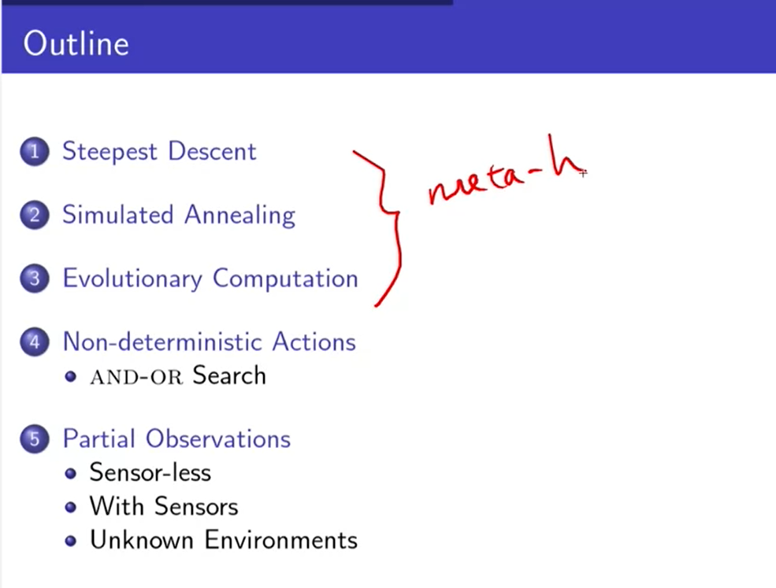

## Black-Box Optimization（黑盒优化）

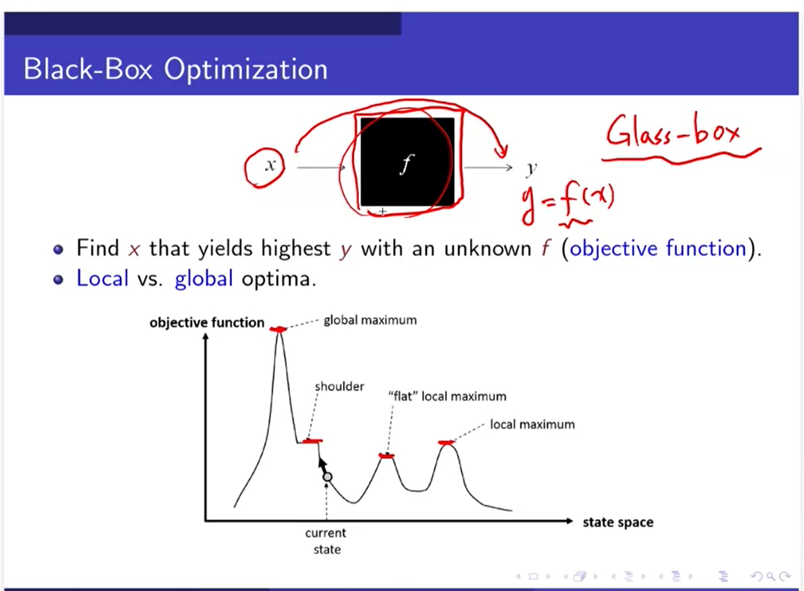

- 计算机主要解决两类问题：
  1. Equation Solving: 只有一个最佳解。
  2. Optimization: 存在多个解，对于每一个解会反馈得到不同的分数，目标就是获取最大分数的那个解。
- Optimization 存在两种:
  - 一种是Black-Box Optimization，也就是**不知道从$x$映射到$y$的$f$，即$f_{unknow}(x) \to y $。**
  - 另一种是Glass-Box Optimization，**知道从$x$映射到$y$的$f$，即$f_{know}(x) \to y $。**
    - 虽然一般上来说Glass-Box问题比较简单，但是在实际应用中，因为所给的$f_{know}(x)$比较复杂，可能会由一系列（成百上千个）的函数构成，导致**无法通过简单的求微分来解决，此时将Glass-Box问题也视为Black-Box问题来解决。**

## Steepest Descent（爬山算法）

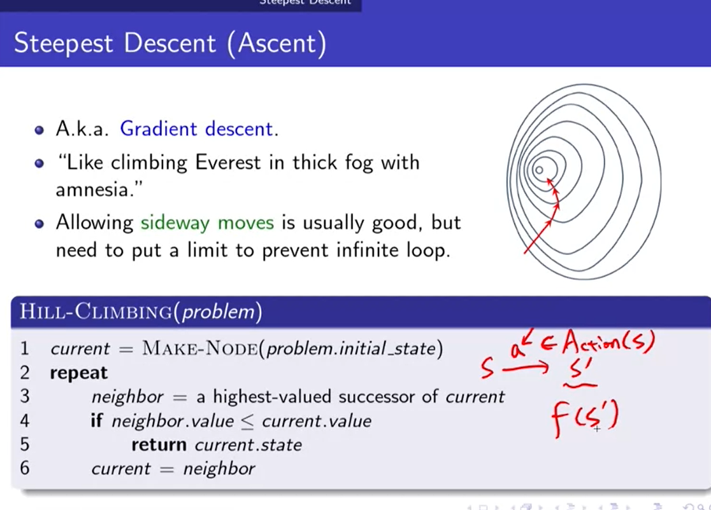

- **爬山算法**就是在当前$s$的周围，检索并用$f$（上文图片中的）计算所有的状态，从中取出最好的一个状态$s'$，并从当前$s$转移到$s'$，不断重复，直到周围没有更好的状态为止。

- *关键问题：对于周围的状态如果与当前状态一样，是否需要进行转移？*
  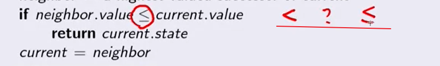

  - 如果不转移，在如图所示的情况，也就是有一个平原的地方就无法达到最好。
    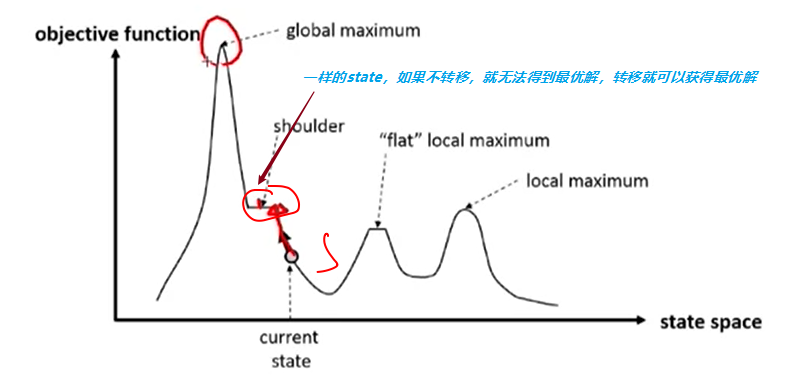
  - 如果进行转移，就会出现在一个平原上进行无穷循环。
    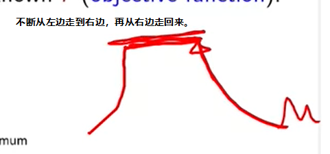
  - 解决办法：一般使用$\le$，同时设置一个`step limit​`，当相同的情况超过这个`limit`，则不再继续执行下去。
    - 缺点：虽然限制了无穷循环的问题，但也限制了该算法探索的能力。
  
- 例子：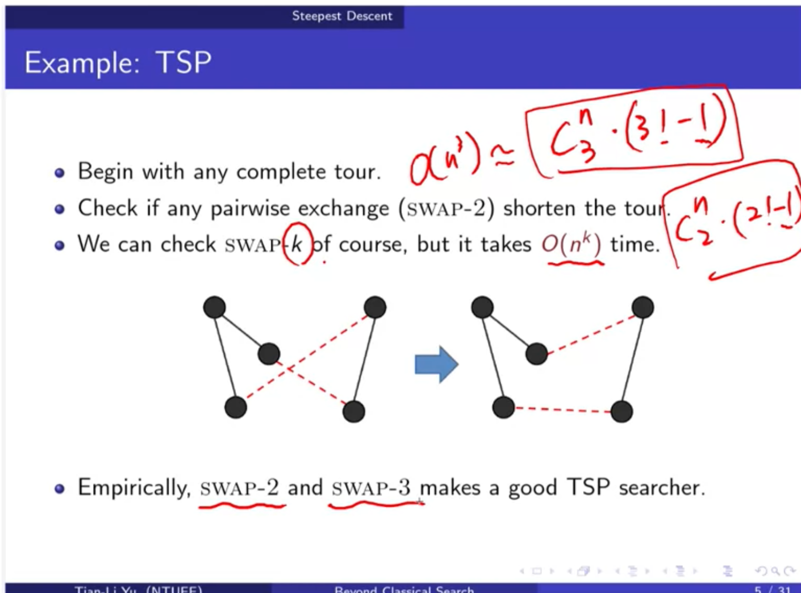

- 对于`TSP`问题，可以使用爬山算法，一般可以使用`SWAP-2`或`SWAP-3`来从原来的路径顺序来获取新的路径，然后使用新的路径函数来计算总的cost，选取cost最少的那个作为当前新的路径。

### Steepest Descent性能

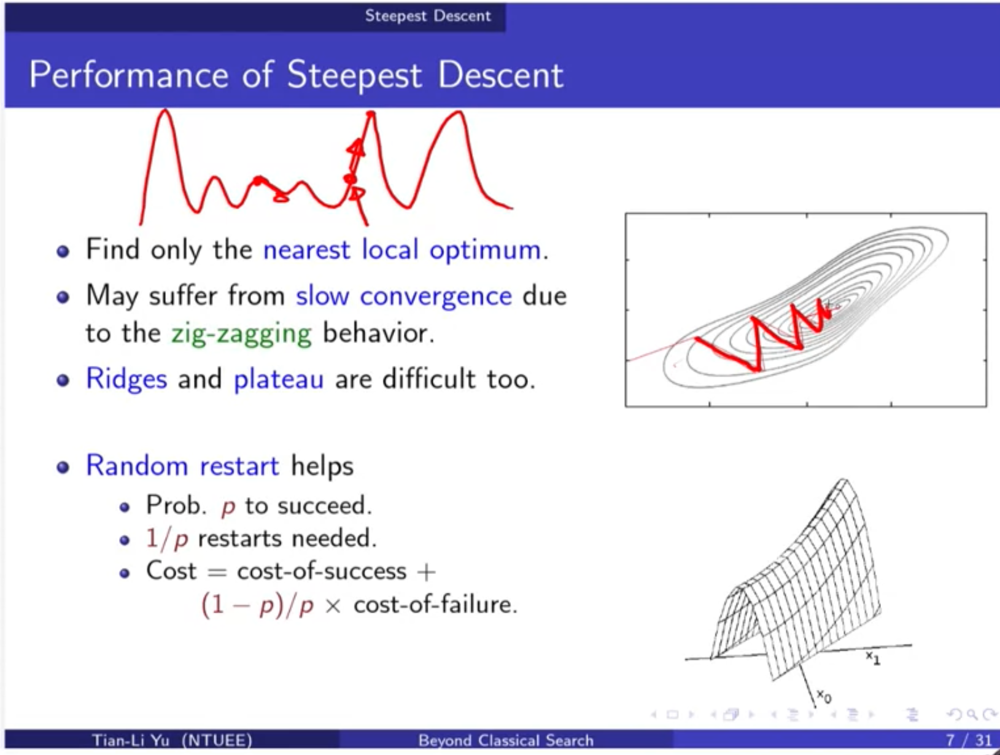

- 只能找到**离初始位置最近的局部最优解。**
- 如果给的初始值的位置不好，那么**收敛的速度可能比较慢。**
  - 如果对于等高线比较陡的情况下，例如处于一个山脊附近，如果**走的步长比较大，很可能直接越过山脊，到达背面**，然后下一步又从背面回来，需要很多步才能到达山脊的顶端。
- 纯粹的`Steepest Descent`（即不加任何优化技巧）**能否取到全局最优解，依赖于设置的初始位置是否在最优解的附近。**

## Simulated Annealing(SA) 模拟退火

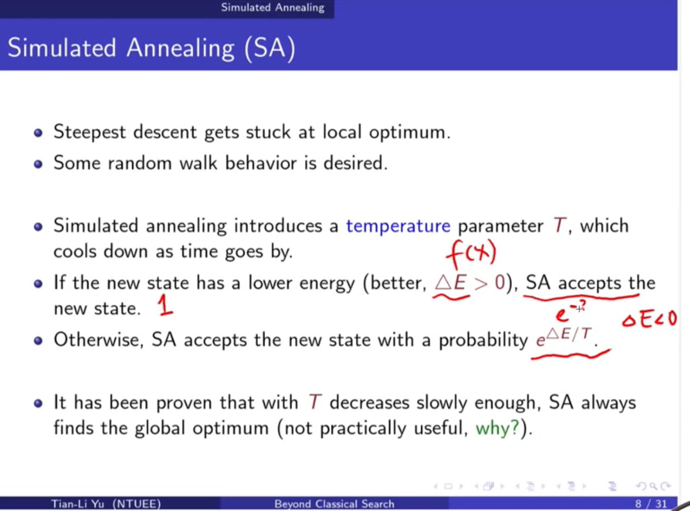

- `SA`主要用于解决**`Steepest Descent`只能获得局部最优解的问题。**
- `SA`在**初期的时候会进行一些`random walk`的行为**，会尽可能广泛的去做一些探索，在**后期会进行`Steepest Descent`的行为。**
- `SA`设置一个参数T（代表当前所处的温度）
  - **T越高，则代表当前越能够接受较差的情况；反之则越不能够接受。**
  - **当T比较低的时候，`SA`将会直接接受一个更好的新状态。**对于比当前差的状态，**不是直接拒绝，而是以一种概率$e^{\Delta E/T}$来接受**，也就是说在T较低的时候，也会转移到一个比当前状态更差的状态去。**但随着T越来越低，这个接受更差状态的概率也会越来越低，直到无限接近0，**此时与`Steepest Descent`基本一致。
- `SA`从理论上讲，**只要T下降的够慢（也就是要无限的时间），就一定可以找到一个全局最优解**（没啥用，因为无限的时间不符合实际）。

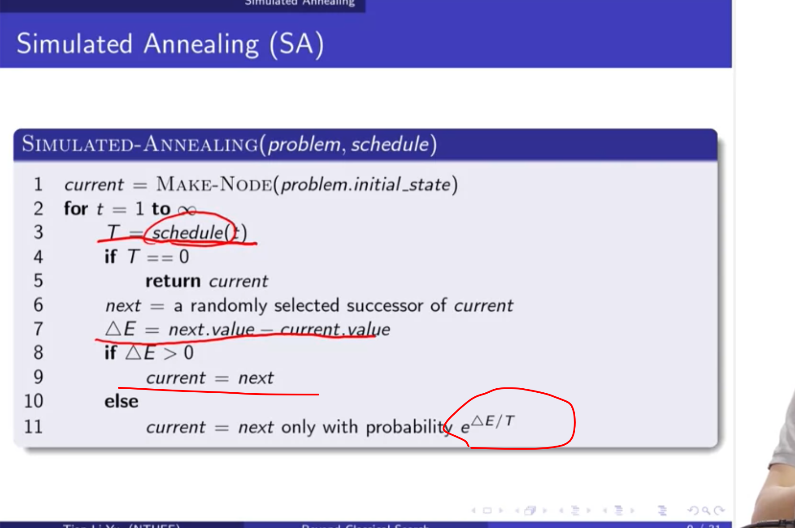

- T是一个**随时间改变的函数**
- 计算**下一个状态与当前状态的差值作为$\Delta E$**（也就是用来评估是否是一个更好的状态），**如果$\Delta E > 0$则直接接受，否则以$e^{\Delta E/T}$的概率来接受。**

## Local Beam Search（局部集束搜索）

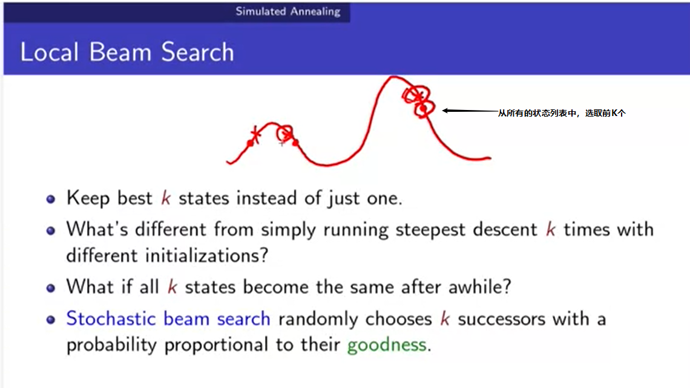

- **同时记录$k$个状态**，从$k$个随机生成的状态开始，**每一步都同时生成这$k$个状态的全部后继状态**，如果生成的状态中有一个是目标状态，则停止，否则**从整个后继列表中（注：包含原有的$k$个状态）选择出新的$k$个最佳后继**，并不断重复这个过程。
- 该方法与简单的串行运行$k$次同样的搜索有着**极大的不同**，因为**搜索的信息会并行的在搜索线程中传递，也就是会产生`群聚效应`，这样可以让算法将更多的资源用在可以取得较大进展的路径上。**
- 缺点：
  - 正常情况下，这$k$个状态最终会聚集到一个最好的值上面去，但有时候会出现下述情况，即，**这$k$个状态聚集在了一个不是最好的解上面，而最好的那个值却没有一个状态在上面。**
  - 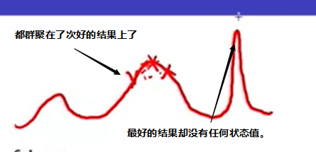
  - 解决办法：使用`Stochastic beam search`（随机集束搜索），该算法在选择新的状态的时候，**不再是选最好的前$k$个，防止群聚过快，而是以一种概率（概率值是状态值的递增函数）的方式来随机的选择$k$个后继状态**

## Darwinian Evolution（达尔文演化论）

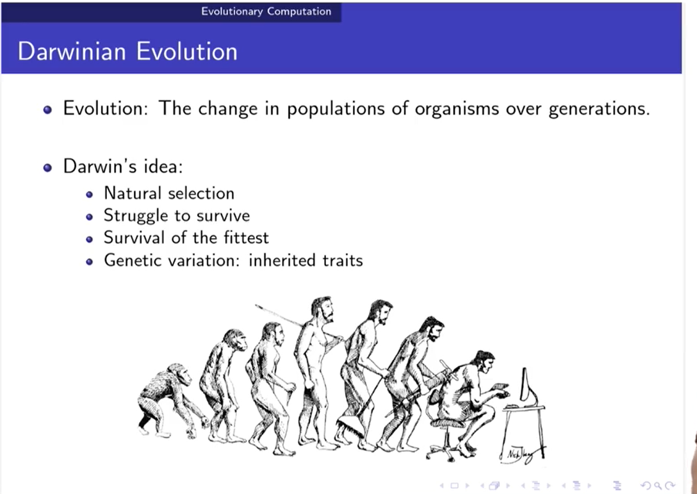

- 演化：不同的世代之间产生变异。
- 达尔文的思想：
  1. 自然选择
  2. 生存艰难
  3. 适者生存
  4. **产生变异（重点）**

### Genetic Algorithm（遗传算法 ）

- 遗传算法的发展有两个阶段，一个是90年代以前，彼时的遗传算法属于简单遗传算法（SGA），另一个是90年至今。

#### 90年代以前的SGA

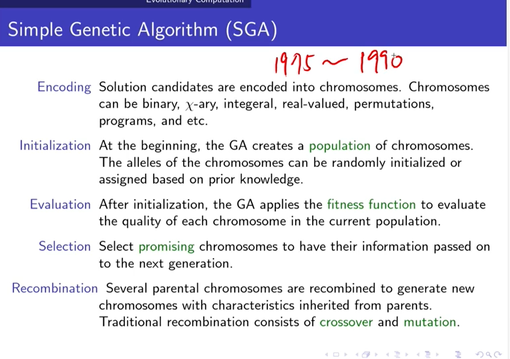

- SGA包含以下五个步骤：
  1. **Encoding**: `SGA`需要对问题进行`编码`处理，因为它无法直接作用到问题上来。编码的结果可以是二进制、整数、实数、数列甚至是程序。。。
  2. **Initialization**: 随机初始化一组状态 ，称为`种群`。另外，在初始化的时候，可以基于一些已知的知识来产生`种群`，以便提高适应性。
  3. **Evaluation**: 在初始化之后，对初始的种群应用`目标函数`或`适应度函数`来给出评估值。 
  4. **Selection**: 对于结果的选择，在早期会直接选择前$k$好的结果留下来，剩下的淘汰掉；现在一般会从所有的结果中，多次随机挑选出一对结果，留下好的，淘汰差的（引入随机性）。
  5. **Recombination**: 一般来说包含`crossover`与`mutation`，即`杂交`与`突变`。但自90年代以后，产生了许多新的方法，此处更多的是一个统称，即对产生新生代方法的统称。

- 一个SGA的例子：
- 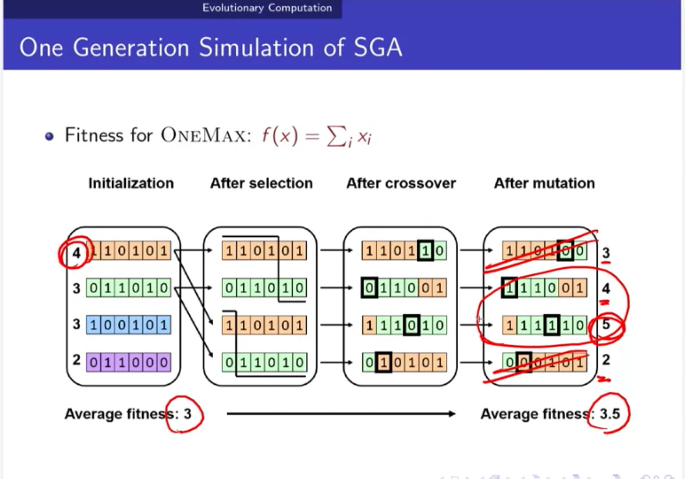

#### 90年代以后的GA

90年代以前的`Reombination`大都是一种随机性质的，也就是会随机选择一个位置进行杂交组合。

产生的问题：有时候对于一组序列，其实它们是不可以进行分割的，或者说，如果分割之后，会产生很差的结果。

如图：

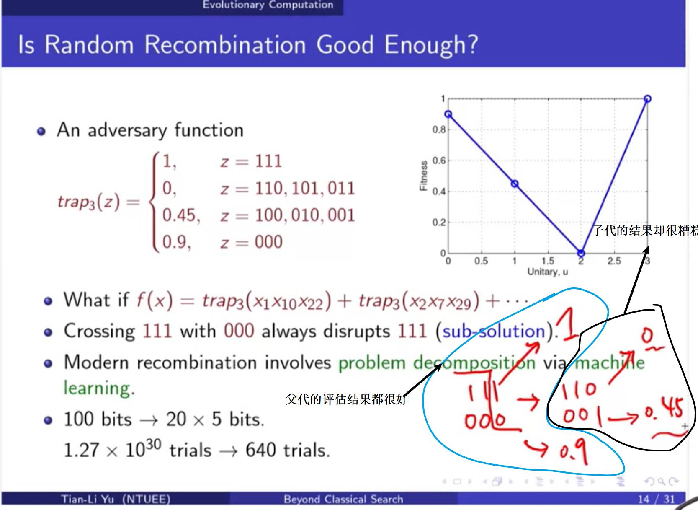

所以，在90年代以后，GA的研究重点更多的在于，如何去辨别那些不可以分割的部分（`Building Block`，即基础组件)，即一旦分割了，结果会变得很糟糕。

现代的`recombination`使用机器学习的方式，来对问题进行解构并做分析。通过对我们未知的$f$函数进行多次的输入，从输出来分析得出，我们所需求解的问题是由哪些基本结构组成的。

## 不确定动作的搜索

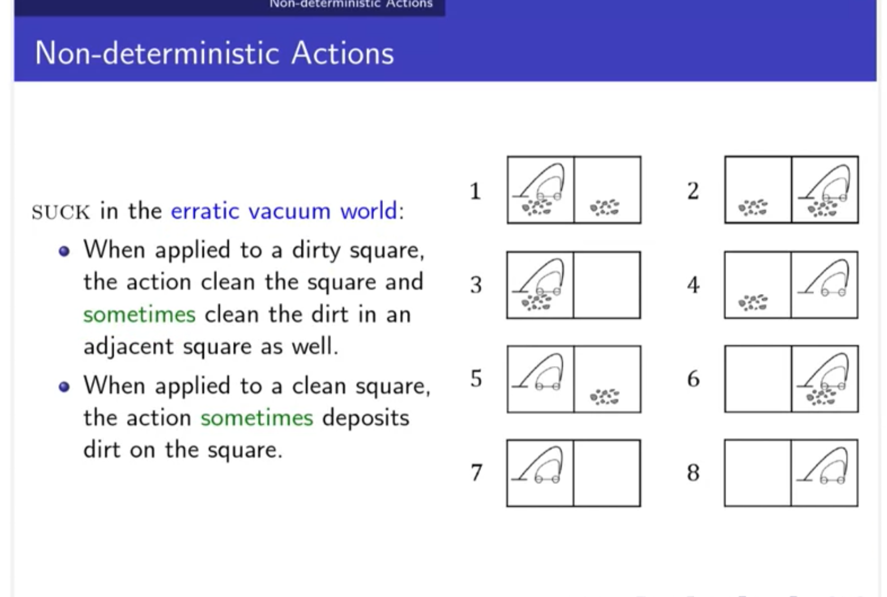

假设由一个不确定系统——一个不稳定的吸尘器世界，具体的可能情况见图。

### 与或搜索树

- 与或搜索树中存在`And`节点与`Or`节点。
- 对于`Or`节点，**只能选择它多个子节点中的一个；**
- 对于`And`节点，无法肯定会到达哪个子节点，因此对于`And`节点，**不管到达哪个子节点，都必须要求该子节点能够把目标完成。 **
- 与或搜索树的`sloution`：对于`Or`节点，只要选择一个分支走就可以；对于`And`节点，必须要两个都走，并且**每一个叶节点都必须要是一个`Goal`**

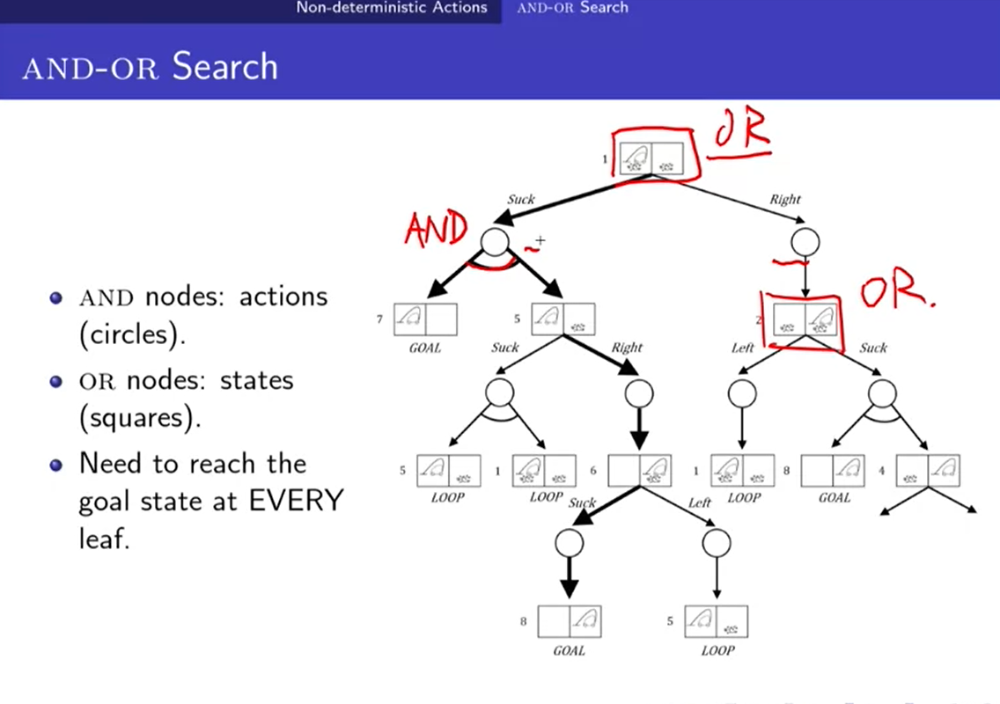

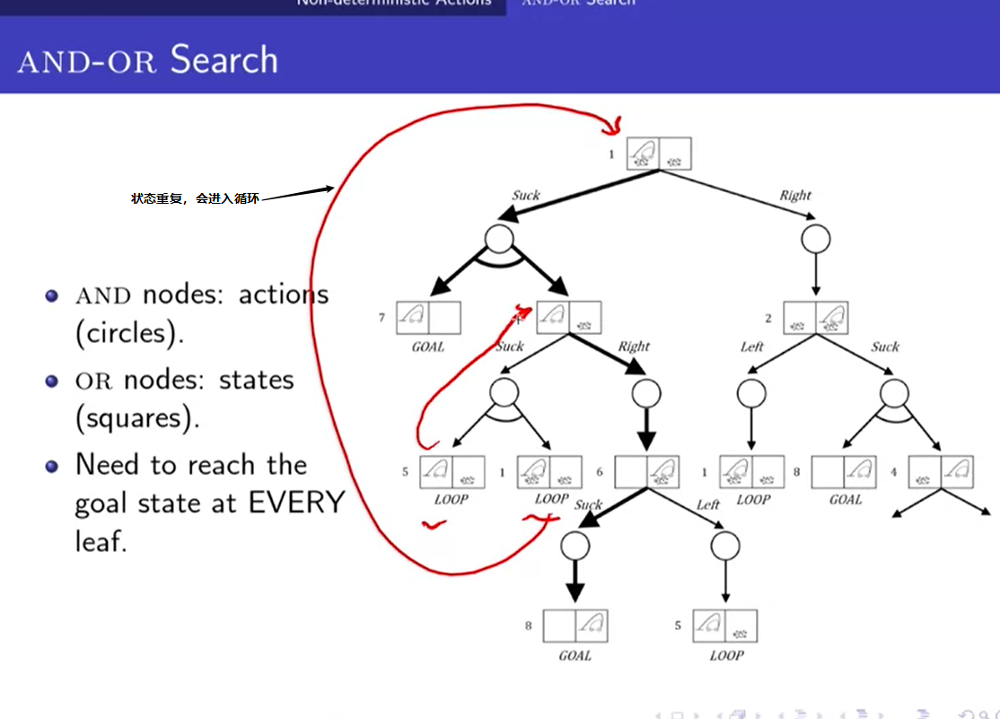

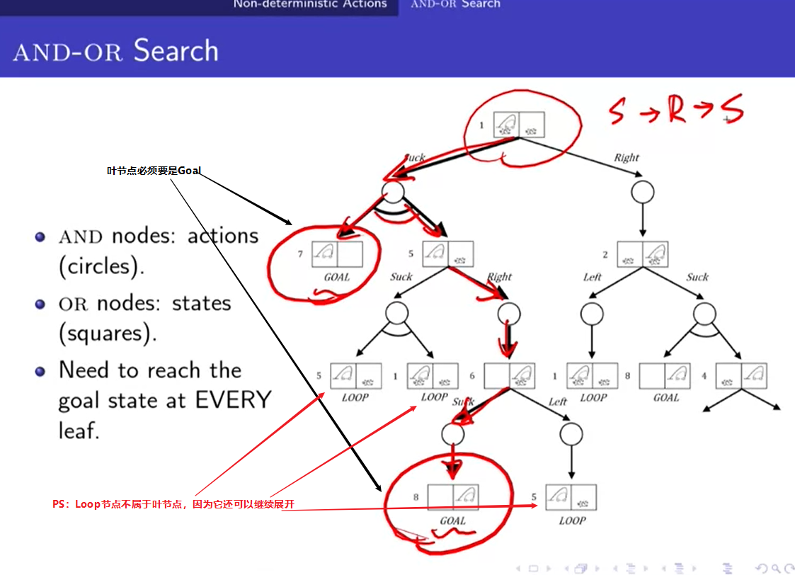

- 与或搜索树的伪代码。
  - `Or`函数与`And`函数互相递归调用
  - 最后的`solution`是一串`if...else if...else if...else...`，以此反应搜索树的分支。

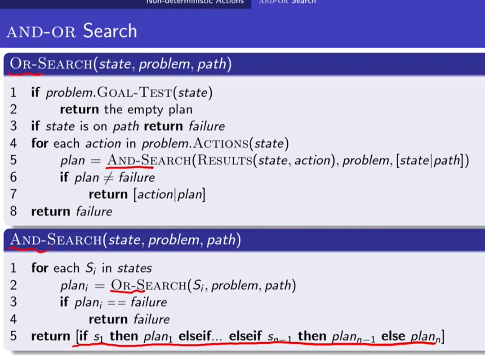

#### 另一个不稳定的吸尘器世界

- 前提假设见图
- 问题：
  - `solution`中会出现有个无穷$loop$的情况，即不知道要循环多少次才能到达目标结果，在尝试的期间，会进入`failure`状态。
  - 产生`failure`的原因：
    1. 如果是一个随机性的概率问题，且概率是非零的，那么就一直进行尝试，总能到达目标。
    2. 如果是因为一些外部无法观测到的因素而导致的失败，那么在尝试了一定次数后（例如100次)，就停止尝试。

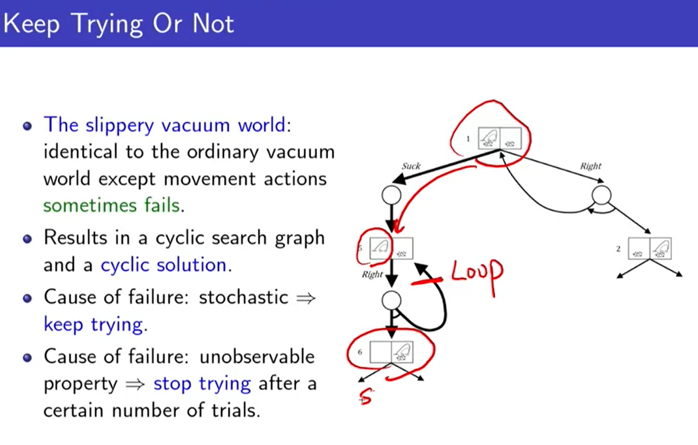

### 使用部分观察到的信息来搜索

- 关键因素：`belief states`，一个set，包含的是在当前的世界中，该`Agent`所相信的状态集合。

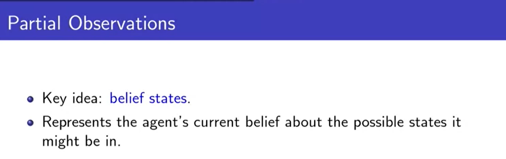

#### 无观察信息的搜索

- 假设有个`no observation`的`agent`。

  - 事实上**没有`sensor`的`agent`比有`sensor`的`agent`更可靠，更加可信**，因为它得出的结论通常**不依赖于`sensor`，而有时`sensor`所给的信息是错误的。**据此，可以推导出，**`sensor`越多的`Agent`的可信度越低。**
  - 一个使用`non-sensor`的例子，在`belief states`中做转移。

  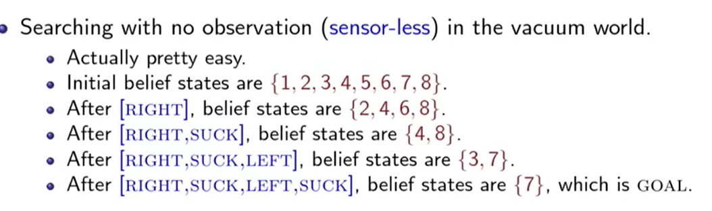

  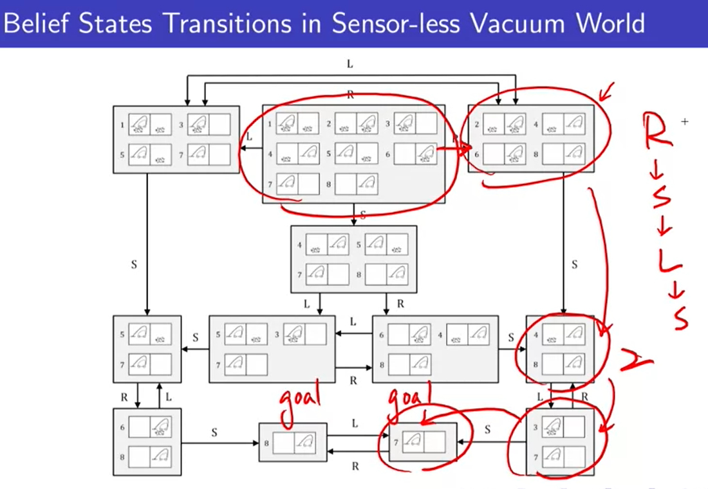

  - 对于一个确定的环境，执行一个`Action`，则到达的状态是不会变多，即`belief states`的数量不会变多，甚至有些时候会变少。
  - 对于一个非确定的环境，执行一个`Action`，则可能到达的状态会变多，因为无法完全确定会到达哪一个状态。

  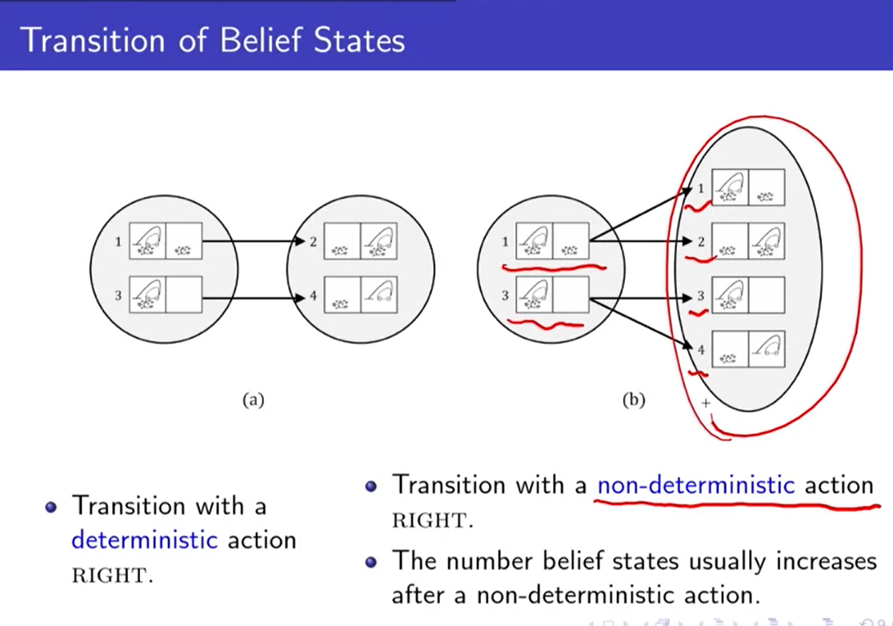

  - 对于一个`Agent`，如果没有`sensor`，且同时处于一个非确定性的环境中，则很难找到一个`solution`。
    - 因为由上一条可知，在非确定环境下，执行一个`Action`后，`states`是会变多的，所以，如果没有`sensor`的协助，来将`states`的数量减少，那么几乎是无法找到一个只有唯一`state`的，也就是只有goal的`state`。

#### 有观察信息的搜索

